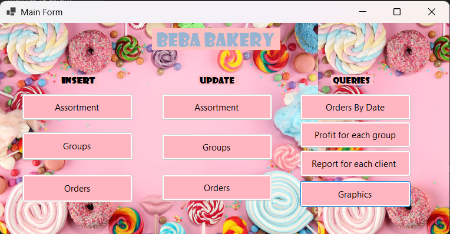
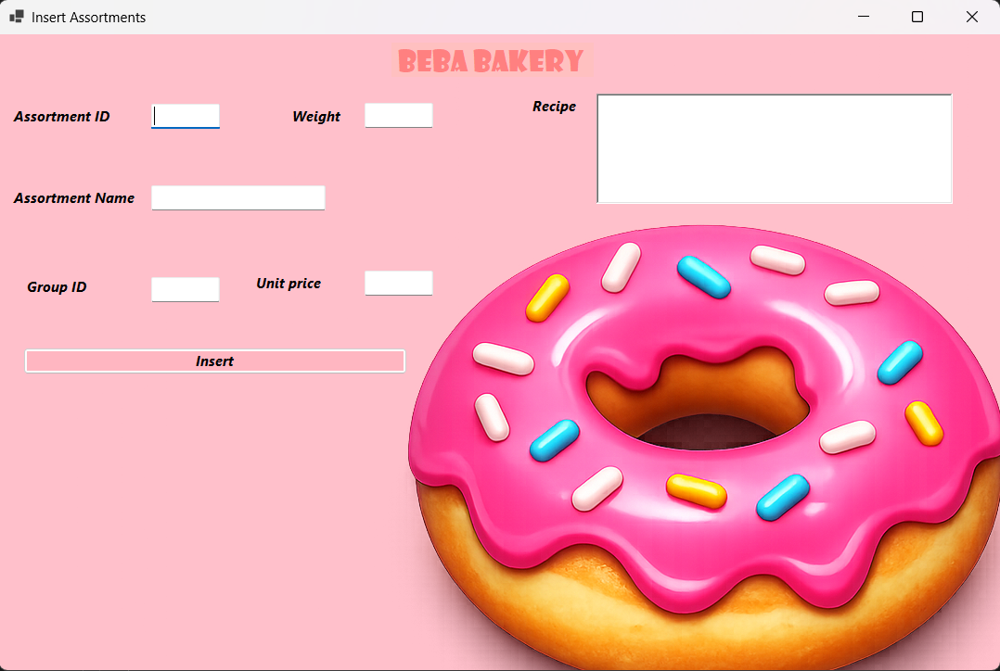
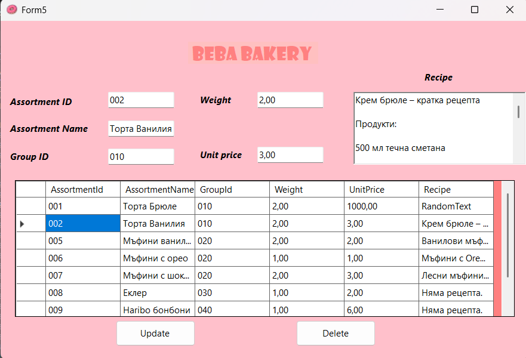
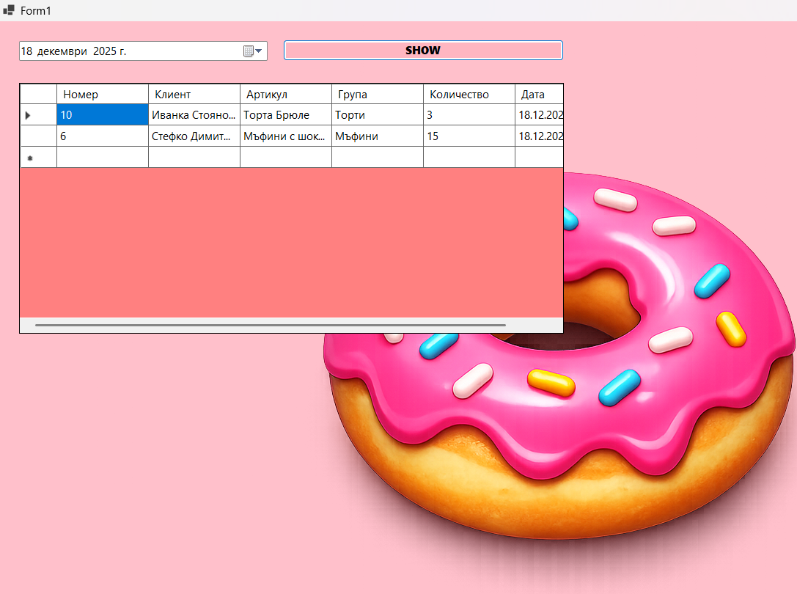
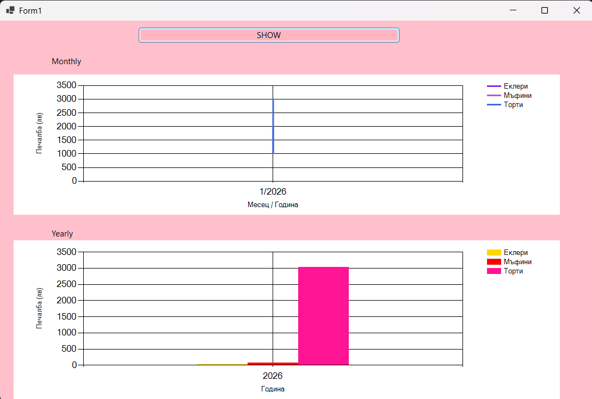

# 🍰 Sweet Shop Management Database

A system for managing confectionery products and orders, developed using a database with forms and reports.

## 📌 Description

The project processes information about:

* product groups
* assortment
* orders

It includes database tables for data storage, forms for adding, editing, and deleting records, as well as queries for data retrieval and analysis.

---

## 🧩 Main Modules

* **Groups** – code and name of confectionery groups
* **Assortment** – code, name, recipe, weight, price, and group association
* **Orders** – order number, delivery date, assortment, availability for production, price, and quantity

---

## ⚙️ Functionalities

* add new records
* edit existing records
* delete records
* filter and reports by date
* calculate revenue for a given period
* analyze revenue by group, assortment, and order
* report for clients with revenue above 1000 BGN
* charts by months, years, and profit

---

## 🗂️ Structure

* `insert` – forms for data entry
* `update` – forms for editing
* `query` – queries, reports, and charts

---

## 📸 Screenshots

### Main Form

### Insert Form

### Update Form

### Query Orders

### Graphics

